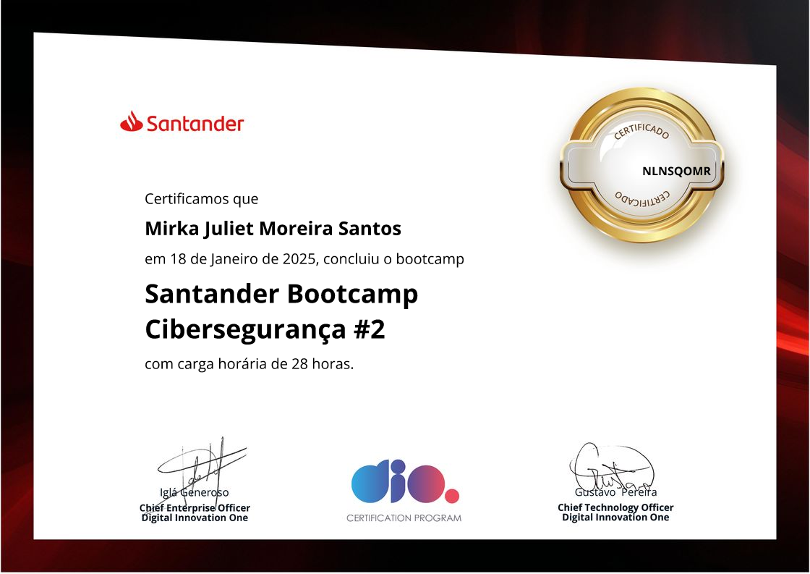

# 🚀 Concluí um Bootcamp de Cibersegurança e Pentest! 🚀
---

Durante essa jornada intensa, aprofundei meus conhecimentos em segurança ofensiva, testes de intrusão e análise de vulnerabilidades, explorando ferramentas e técnicas essenciais para identificar e mitigar riscos cibernéticos.
---

## 🔎 Principais aprendizados:
- **🔹 Pentest (Penetration Testing)** – Identificação de falhas e vulnerabilidades em sistemas e redes para fortalecê-los.
- **🔹 Engenharia Social** – Técnicas de manipulação psicológica para obtenção de informações sensíveis.
- **🔹 OSINT (Open-Source Intelligence)** – Coleta de informações públicas para investigações cibernéticas.
- **🔹 Google Hacking** – Uso de dorks para refinar buscas e obter informações valiosas.
- **🔹 Varredura de Redes** – Técnicas como TCP, UDP, ICMP para mapear alvos e coletar dados sobre sistemas.
- **🔹 Enumeração** – Descoberta de usuários, serviços, portas abertas e aplicações através de ferramentas como Nmap, Netcat, NBTScan e Dumpsec.
- **🔹 Exploração de Vulnerabilidades** – Uso de exploits através de ferramentas como Metasploit.
- **🔹 Pós-Exploração e Escalonamento de Privilégios** – Elevação de permissões para obter controle total de um sistema.
- **🔹 Detecção de Phishing** – Identificação de padrões suspeitos em e-mails e sites fraudulentos.
- **🔹 Monitoramento de Segurança** – Análise de logs para detectar tentativas de invasão e ataques cibernéticos.
- **🔹 Backdoors** – Identificação e mitigação de acessos persistentes em sistemas comprometidos.
- **🔹 Pós-exploração** – Como manter acesso e coletar informações após uma invasão bem-sucedida.
- **🔹 Ataques Man-in-the-Middle (MITM)** – Interceptação e manipulação de tráfego de rede.
- **🔹 Ferramentas de segurança** – Utilização de Metasploit, Bettercap, Ettercap, Cain & Abel, Wireshark e outras soluções.
- **🔹 Sniffing e captura de pacotes** – Identificação de tráfego e análise de comunicações.
- **🔹 Exploits e backdoors** – Como explorar sistemas vulneráveis e entender as táticas usadas por atacantes.

---

## 💡 Ferramentas e Tecnologias utilizadas:
- **✅ Nmap** – Varredura de redes e detecção de portas.
- **✅ Metasploit** – Plataforma para exploração de vulnerabilidades.
- **✅ Netcat** – Ferramenta para testes de rede e comunicação.
- **✅ Meterpreter** – Ferramenta para pós-exploração.
- **✅ OSINT Framework** – Pesquisa avançada para obtenção de informações

---
# 🎓 Bootcamp Santander Bootcamp Cibersegurança #2 📊

Esse aprendizado reforça a importância da cibersegurança e da necessidade de profissionais capacitados para proteger sistemas e redes. 💻🔐
**#CyberSecurity #Pentest #EthicalHacking #Bootcamp #SegurançaDaInformação #HackingEthico**
